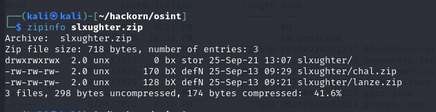
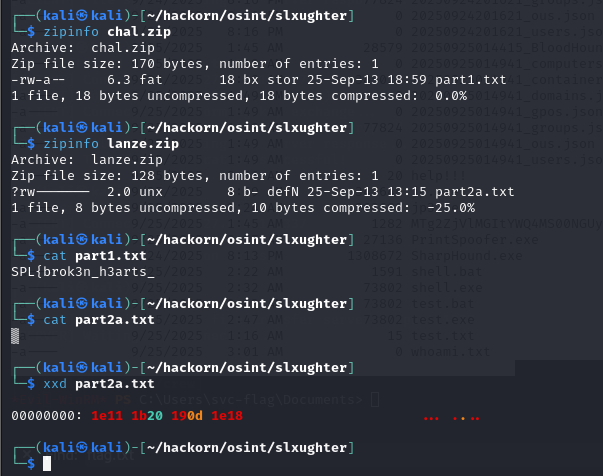
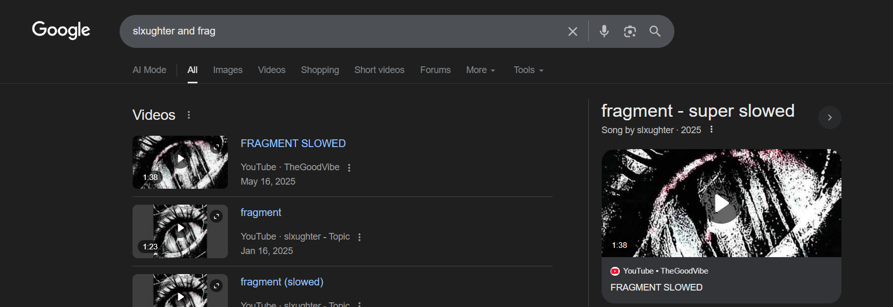

# Slxughter



After extract 2 zip file we got 2 parts



First part SPL{brok3n_h3arts_
And second is hex 1e111b20190d1e18
So i tried brok3n_h3arts_1e111b20190d1e18 and -1 attempt ;-;


Part2a look weird so i tried run xor bruteforce with it

```python
encoded_bytes = [0x1e, 0x11, 0x1b, 0x20, 0x19, 0x0d, 0x1e, 0x18]

for key in range(1, 256):
    decoded = ''.join([chr(b ^ key) for b in encoded_bytes])
    if all(32 <= ord(c) <= 126 for c in decoded):
        print(f"key={key}: {decoded}")
```
and found key key=127: and_frag

so i tried brok3n_h3arts_and_frag and still wrong so -1 attempt ;-;

i search "slxughter and frag" on google and got this song



last attempt i was worry whether this is correct or not ;-; i was worried ngl ;-; but then it correct

Gud song btw :>

SPL{brok3n_h3arts_and_fragment}