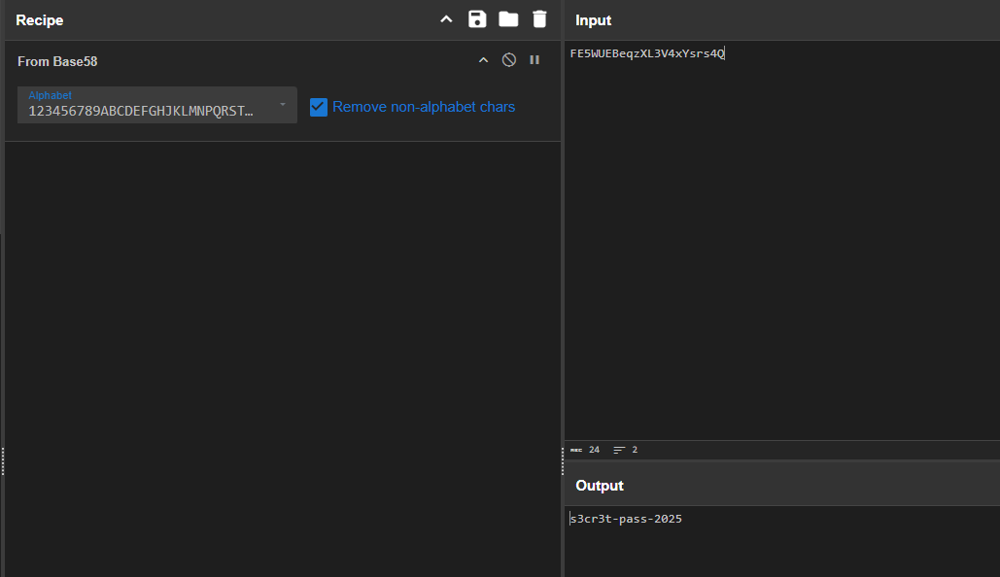
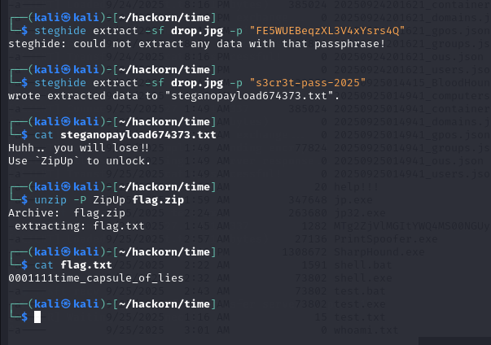

# Time capsule

I notice one of the PGP blocks has a `Comment:` field:  

```
-----BEGIN PGP PUBLIC KEY BLOCK-----
Version: OpenPGP 1.0
Comment: FE5WUEBeqzXL3V4xYsrs4Q

Uh607lZ54M0kQ0sNQUF8WgpUanxbUEeto+9jS7gTCDjXpZDXJElTUDult29e4Uze
S3KWUjzwtRNtEZMhjbl5pDlqB0RiJihZnxihu5UCwGJx9cuaEYZclcQTI3lbs1+k
q/BpHsvhag+K8tYTWJ2l+Kipym1G56g711FbgCuXk9g=
-----END PGP PUBLIC KEY BLOCK-----
```

The comment `FE5WUEBeqzXL3V4xYsrs4Q` might be base64 encoded. Let's decode it:  

```bash
echo "FE5WUEBeqzXL3V4xYsrs4Q" | base64 -d
```

But base64 decoding might give binary if it's not plaintext. Let's try:  

```bash
echo "FE5WUEBeqzXL3V4xYsrs4Q" | base64 -d && echo
```
This might produce gibberish, so maybe it's not base64 but the actual password.

Given the log said "comment contains pubkey id: ABC123" — but `ABC123` is not in the `pubkeys.asc` file literally.  
Maybe `FE5WUEBeqzXL3V4xYsrs4Q` is related to `ABC123` somehow, or maybe that comment is the password.

---

Let's try `FE5WUEBeqzXL3V4xYsrs4Q` as the zip password:  

```bash
unzip -P "FE5WUEBeqzXL3V4xYsrs4Q" flag.zip
```

If that doesn't work, maybe the `old_portal` string is the password, or we need to extract something from `drop.jpg` using `FE5WUEBeqzXL3V4xYsrs4Q` as the steghide passphrase.  

---

**Try steghide with that comment as passphrase:**  

```bash
steghide extract -sf drop.jpg -p "FE5WUEBeqzXL3V4xYsrs4Q"
```

If it extracts a file, that file may contain the real zip password.

but it doesn't work so i tried to decode it 



```bash
steghide extract -sf drop.jpg -p "s3cr3t-pass-2025"
```



```
SPL{0001111time_capsule_of_lies}
```